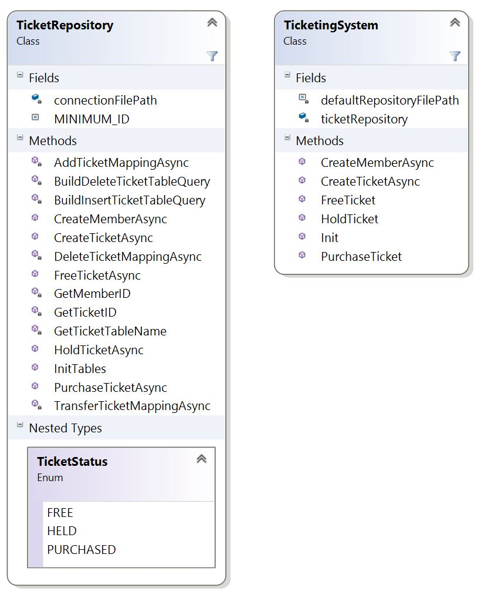
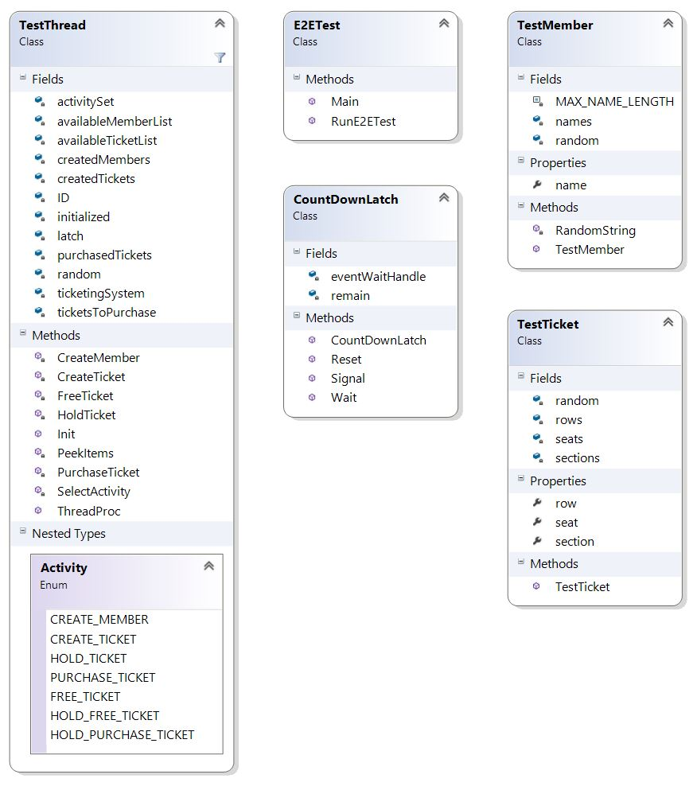

Challenge: Create and Test a Ticketing System  
==
We need the backend of an online event ticketing system.  The system should be robust enough to 
allow thousands of customers to access thousands of tickets.  Create a Visual Studio solution with 
two C# projects.  One project is the backend system.  The other project will test the backend system.
 
For this challenge, no need to have things online or stored in an actual database.  It's really 
about the logic, design and coding.  This could certainly grow to be a very elaborate system but 
today's exercise is a simple proof of concept.
 
Backend
--

Customers should be able to freely place tickets in their cart but tickets are not locked until 
customer is ready to check out.  Tickets are unavailable after a successful purchase.  While such 
a system could grow to be very complex with dozens of tables, ours should be very simple with 
perhaps only a ticket and a member table.  For example:
 
- Ticket: id, section, row, seat#
- Member: id, Name
 
Ultimately, the design is completely up to you.  Your database could be simple lists maintained in 
memory or something more elaborate like a MySQL database.  Mainly, the system should be capable of 
dealing with simultaneous access from thousands of customers.  This definitely will require 
synchronizing access.  I recommend C#'s asych and await keywords.
 
Please make this a C# DLL project whose interface is a class that allows the following 
functionality:

- Create a new set of tickets
- Allow tickets to be locked
- Allow tickets to be purchased (again, simple; no credit card or currency) or unlocked

 
Testing
--

The second project needs to simulate real-life use.  It will obtain an interface from the backend 
DLL and use it hammer the backend.
 
This project should be a C# application.  No UI is necessary.

Solution
==

Backend
--

The backend is designed to leverage SQL Server Compact and its built in concurrent logic.  SQL CE
was then leveraged because it provided offline databasing that was quick and easy to edit through 
Visual Studio using the SQL CE Toolbox.  The implementation leverages the following tables:

    Members  
    - ID: int  
    - Name: string(50)

    Tickets  
    - ID: int  
    - T_SECTION: int  
    - T_ROW: int  
    - T_SEAT: int  

    TicketsFree  
    - ID: int  
    - TICKET_ID: int  

    TicketsHeld  
    - ID: int  
    - TICKET_ID: int  
    - MEMBER_ID: int  

    TicketsPurchased  
    - ID: int  
    - TICKET_ID: int  
    - MEMBER_ID: int  

Members and Tickets are pretty self-expalantory tables that allow each object type to be mapped to 
an entry ID.  The TicketsFree, TicketsHeld, and TicketsPurchased tables are mapping tables that keep
track the current state of each ticket.

Tickets can only migrate in the following fashion:

    TicketsFree <> TicketsHeld <> TicketsPurchased

Where the only the appropriate member mapped to the ticket can initiate the migrations. Migrations 
first attempt to remove the record from the source table, and then only add the record to the 
destination table if previously successful.  This way the design pushes the concurent logistics to 
the atomic database queries built into SQL CE.

###Pros  
- Leverages SQL CE asynchronous logic
- Does not couple tickets to members in their respective schemas

###Cons  
- Connection pool and concurrency logic dependent on SQL CE releases
- Design does not maintain unique entries nor account for duplicate entries

Testing
--
The testing framework is designed so that multiple threads are created that share a pool of tickets 
and members to be created.  Each thread will run and randomly do the following actions until the 
pool of tickets are purchased.

    - Create a Member
    - Create a Ticket
    - Hold a Random Ticket against a Random Member from the Created Pools
    - Free a Random Ticket against a Random Member from the Created Pools
    - Purchase a Random Ticket against a Random Member from the Created Pools
    - Hold and then Free a Random Ticket against a Random Member from the Created Pools
    - Hold and then Purchase a Random Ticket against a Random Member from the Created Pools

Each of these actions will be conducted regardless if it breaks the following rules:

    - Free Tickets can be Held by any Member
    - Held Tickets can only be Freed or Purchased by the Holding Member

###Pros
- Can support one-to-many variations of the following variables: Threads, Members, and Tickets
- Replicates a scenario of rapidly many inputs that are both legal and illegal (such as trying 
to Hold a ticket already Held or Purchased)

###Cons
- Threading support dependant on SQL CE max connection pool and concurrency logic
- Scenarios will not necessarily complete within any time frame as the actions are 
decided on random and not on what is the next legal move (i.e., only purchasing 
if the designated Member is Holding the designated ticket)